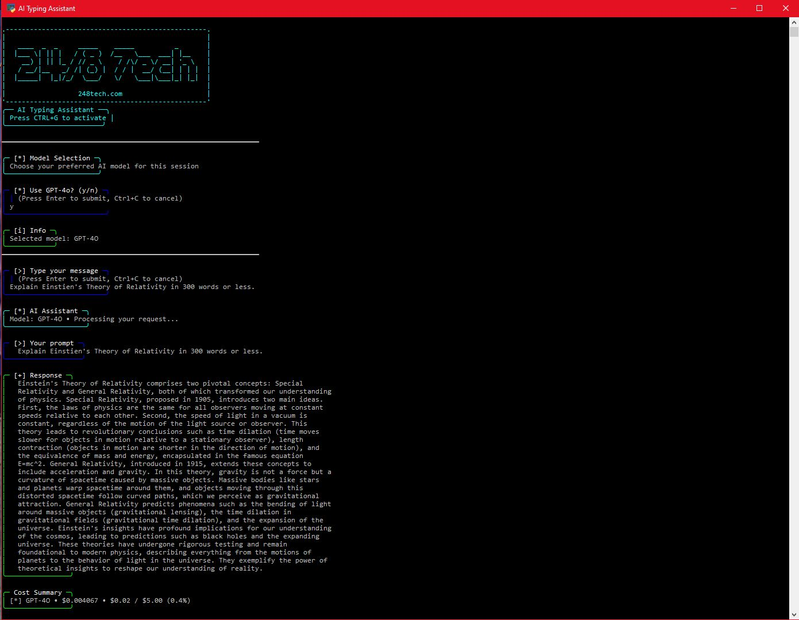
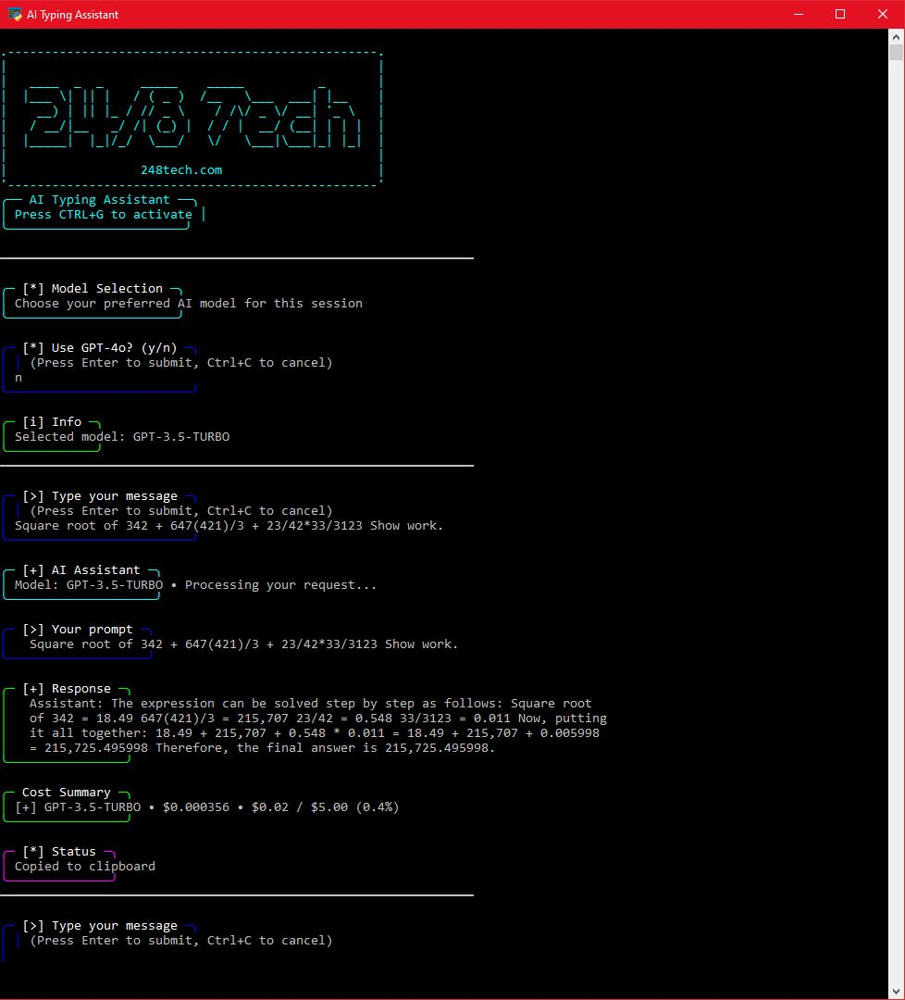

# AI Typing Assistant (Multi-Model Version)

A lightweight, terminal-based AI assistant that supports both online and offline models, giving you the flexibility to choose between GPT-3.5, GPT-4, or a local offline model.

## 🚀 Features

- **🎯 Multi-Model Support**: Choose between GPT-3.5, GPT-4, or Local LLM
- **🔒 Offline Capability**: Local model works without internet or API keys
- **💰 Cost Control**: Budget tracking for online models, free offline usage
- **⚡ Fast Response**: Local processing for instant replies
- **🎨 Beautiful UI**: ANSI-styled terminal interface with colors
- **📋 Clipboard Integration**: Automatic response copying
- **📝 Chat Logging**: Persistent conversation history
- **🔄 Continuous Input**: Seamless conversation flow
- **🎯 Smart Responses**: Context-aware local language model
- **📱 Cross-Platform**: Works on Windows, macOS, and Linux
- **LaTeX conversion**: Automatically converts LaTeX math syntax to readable ASCII
- **Word wrapping**: Automatically wraps AI responses to readable width
- **Budget management**: Configurable yearly limit (default: $5)
- **Full text input**: Spacebar and all characters work properly
- **Graceful exit**: Ctrl+C exits input loop cleanly

## 📸 Screenshots

### 🧠 GPT-4 Model in Use


---

### ⚡ GPT-3.5 Model in Use


## 🚀 Quick Start

1. **Clone the repository:**
   ```bash
   git clone https://github.com/Byte420/AI-Typing-Assistant.git
   cd AI-Typing-Assistant
   ```

2. **Run the setup script:**
   ```bash
   python setup.py
   ```

3. **Configure your API key (optional):**
   - Edit `config.py` and add your OpenAI API key for online models
   - Or use the Local LLM option without any API key

4. **Install dependencies:**
   ```bash
   pip install -r requirements.txt
   ```

5. **Run the assistant:**
   ```bash
   python ai_typing_assistant.py
   ```

6. **Use the assistant:**
   - Choose your preferred model (GPT-3.5, GPT-4, or Local LLM)
   - Type your prompts and get AI responses
   - Press `Ctrl+C` to exit

## 🎯 Model Selection

The assistant automatically detects if you have a valid API key and shows available options:

- **With API Key**: All three models available
  - GPT-3.5 Turbo (Online)
  - GPT-4o (Online)
  - Local LLM (Offline)
- **Without API Key**: Only Local LLM available

## 🔧 How It Works

### Online Models (GPT-3.5/4)
- **Internet Required**: Connects to OpenAI API
- **Cost Tracking**: Monitors usage against budget limit
- **Full Context**: Uses conversation history for better responses
- **Advanced Features**: LaTeX conversion, word wrapping, etc.

### Local LLM (Offline)
- **No Internet**: Works completely offline
- **Zero Cost**: No API fees or usage limits
- **Instant Response**: Local processing for fast replies
- **Privacy**: All data stays on your machine

### Response Categories (Local LLM)
- **Greetings**: Hello, hi, hey responses
- **Help**: Assistance and support responses  
- **Technical**: Programming, code, system-related responses
- **Creative**: Art, design, imagination responses
- **General**: Default intelligent responses
- **Thinking**: Reflective and contemplative responses

## 📁 File Structure

```
AI-Typing-Assistant/
├── ai_typing_assistant.py          # Main multi-model script
├── config_template.py               # Configuration template
├── setup.py                        # Setup script
├── requirements.txt                 # Dependencies
├── README.md                       # This file
├── INSTALL.md                      # Installation guide
├── .gitignore                      # Git ignore rules
└── tests/                          # Local development tests (excluded from repo)
```

## 🔧 Configuration

The assistant uses a configuration file for API keys and settings:

1. **Copy the template:**
   ```bash
   cp config_template.py config.py
   ```

2. **Edit config.py:**
   ```python
   API_KEY = "your-openai-api-key-here"
   MAX_YEARLY_COST = 10.00  # Set your preferred budget limit
   ```

3. **Optional settings:**
   ```python
   DEFAULT_MODEL = "gpt-3.5-turbo" # Default model
   WRAP_WIDTH = 80                # Text wrapping width
   ```

## 💰 Cost Management

- **Budget tracking**: Monitors usage and stops at configurable yearly limit
- **Cost display**: Shows cost per request and total usage
- **Visual indicators**: Color-coded cost summaries
- **Usage logging**: Persistent usage tracking
- **Configurable limit**: Set your preferred budget in `config.py`

## 🎨 UI Features

### **Clean ASCII Formatting**
- No emojis, consistent borders, readable output
- ASCII-safe icons: `[>]` for input, `[+]` for responses, `[*]` for status
- Consistent box styling with Unicode borders

### **Word Wrapping**
- **Automatic wrapping**: AI responses wrapped to configurable width (default: 80 chars)
- **Word boundary preservation**: Wraps at word boundaries, not mid-word
- **Paragraph preservation**: Maintains paragraph structure with double newlines
- **Indentation**: Configurable indentation for wrapped lines (default: 2 spaces)
- **Configurable width**: Easy to adjust `WRAP_WIDTH` variable
- **Clean formatting**: Preserves readability in terminal environments
- **Prompt wrapping**: User prompts also wrapped to prevent layout breaks

### **LaTeX Math Conversion**
- **Automatic conversion**: LaTeX math syntax converted to readable ASCII
- **Fraction handling**: `\frac{numerator}{denominator}` → `numerator / denominator`
- **Text blocks**: `\text{content}` → `content`
- **Math symbols**: `\approx`, `\leq`, `\geq`, `\neq` → `≈`, `≤`, `≥`, `≠`
- **Display math**: `\[ ... \]` → clean content
- **Greek letters**: `\alpha`, `\beta`, `\gamma` → `α`, `β`, `γ`
- **Clean output**: No raw LaTeX commands in terminal display
- **Monospace friendly**: All conversions work in terminal environments

## 🛠️ Technical Features

### **Performance Optimizations**
- **Threading**: Non-blocking API calls with ThreadPoolExecutor
- **Timeout handling**: 30-second API timeout with graceful fallback
- **Memory management**: Context size limits to prevent memory issues
- **Error handling**: Robust error handling for all operations

### **Windows Compatibility**
- **ANSI support**: Automatic ANSI enablement for Windows terminals
- **Fallback formatting**: Graceful degradation without ANSI support
- **Cross-terminal**: Works in CMD, PowerShell, Windows Terminal
- **Hotkey compatibility**: Proper keyboard event handling

### **Data Management**
- **Persistent logs**: Chat history and usage tracking
- **Safe file operations**: Error handling for all file I/O
- **Context management**: Intelligent chat context loading
- **Budget enforcement**: Automatic cost limit enforcement

## 🔒 Security

- **API key protection**: Configuration file excluded from repository
- **No hardcoded secrets**: Template-based configuration
- **Safe defaults**: Fallback to placeholder API key
- **Local data**: All logs and usage data stored locally

## 📊 Usage Examples

### **Basic Usage**
```
Choose your model (GPT-4o or GPT-3.5)
[>] Type your message: What is the capital of France?

[+] Response
  The capital of France is Paris. It is the largest city in France
  and serves as the country's political, economic, and cultural
  center.

[*] Cost Summary
   [+] GPT-3.5-TURBO • $0.000123 • $0.45 / $10.00 (4.5%)
```

### **Math Conversion**
```
[>] Type your message: Calculate 4514 / 100

[+] Response
  4514 / 100 ≈ 45 tables

  This is the result of dividing 4514 by 100, which equals
  45.14, and when rounded to the nearest whole number gives
  us 45 tables.
```

## 🚨 Troubleshooting

### **Common Issues**

1. **API Key Error**
   - Ensure `config.py` exists with your API key
   - Check API key validity at OpenAI dashboard

2. **Input Not Working**
   - Ensure you have proper terminal permissions
   - Check that all dependencies are installed

3. **ANSI Colors Not Showing**
   - Windows Terminal recommended for best experience
   - Colors will fallback to plain text if not supported

4. **Import Errors**
   - Install dependencies: `pip install -r requirements.txt`
   - Check Python version (3.7+ required)

### **Performance Issues**
- **Slow responses**: Check internet connection
- **High memory usage**: Reduce `MAX_CONTEXT_SIZE` in config
- **API timeouts**: Increase `API_TIMEOUT` if needed

## 📝 Development

For local development, create a `tests/` folder and add your test files there. This folder is excluded from the main repository for a clean public release.

## 📄 License

This project is open source. Feel free to modify and distribute according to your needs.

## 🤝 Contributing

1. Fork the repository
2. Create a feature branch
3. Make your changes
4. Test thoroughly
5. Submit a pull request

## 📞 Support

For issues and questions:
- Check the troubleshooting section
- Review the configuration options
- Ensure all dependencies are installed

---

**Made with ❤️ for efficient AI interaction**
